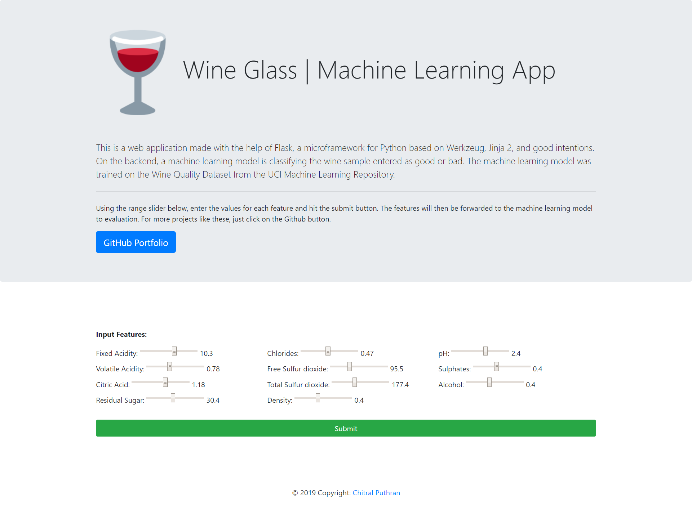
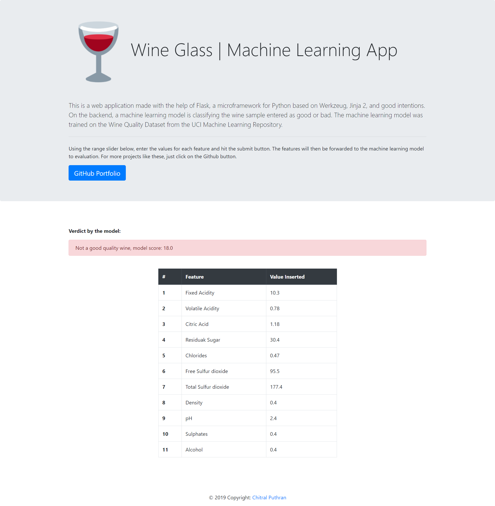

# :wine_glass: Wine Glass | Machine Learning App

This is a web application made with the help of Flask, a microframework for Python based on Werkzeug, Jinja 2, and good intentions. On the backend, a machine learning model is classifying the wine sample entered as good or bad. The machine learning model was trained on the Wine Quality Dataset from the UCI Machine Learning Repository.
  
[Link to the Web Application](https://wine-glass.herokuapp.com/)

  

### Home-Page:

### Prediction Page:

